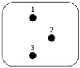
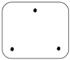
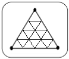
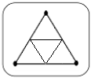
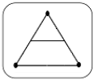
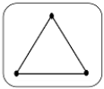
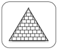
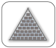

<section id="themes">
	<h2>Themes</h2>
		<p>
			Set your presentation theme: <br>
			<!-- Hacks to swap themes after the page has loaded. Not flexible and only intended for the reveal.js demo deck. -->
                        <a href="#" onclick="document.getElementById('theme').setAttribute('href','css/theme/black.css'); return false;">Black (default)</a> -
			<a href="#" onclick="document.getElementById('theme').setAttribute('href','css/theme/white.css'); return false;">White</a> -
			<a href="#" onclick="document.getElementById('theme').setAttribute('href','css/theme/league.css'); return false;">League</a> -
			<a href="#" onclick="document.getElementById('theme').setAttribute('href','css/theme/sky.css'); return false;">Sky</a> -
			<a href="#" onclick="document.getElementById('theme').setAttribute('href','css/theme/beige.css'); return false;">Beige</a> -
			<a href="#" onclick="document.getElementById('theme').setAttribute('href','css/theme/simple.css'); return false;">Simple</a> <br>
			<a href="#" onclick="document.getElementById('theme').setAttribute('href','css/theme/serif.css'); return false;">Serif</a> -
			<a href="#" onclick="document.getElementById('theme').setAttribute('href','css/theme/blood.css'); return false;">Blood</a> -
			<a href="#" onclick="document.getElementById('theme').setAttribute('href','css/theme/night.css'); return false;">Night</a> -
			<a href="#" onclick="document.getElementById('theme').setAttribute('href','css/theme/moon.css'); return false;">Moon</a> -
			<a href="#" onclick="document.getElementById('theme').setAttribute('href','css/theme/solarized.css'); return false;">Solarized</a>
		</p>
</section>

H:

# Rendering

Visual Computing

H:

# Outline

1. Introduction: the problem
2. Ray-tracing approach
3. Rasterization approach
4. Final thoughts

H:

## Introduction: Alberti's Veil
### Linear perspective

<figure>
    
    <figcaption>[Dürer's Alberti Veil](http://visualcomputing.github.io/Cognitive)</figcaption>
</figure>

V:

## Introduction: [Virtual camera model](https://www.scratchapixel.com/lessons/3d-basic-rendering/3d-viewing-pinhole-camera/virtual-pinhole-camera-model)
### Representation

<figure>
    
    <figcaption>Non inversion of the rendered image</figcaption>
</figure>

V:

## Introduction: [Virtual camera model](https://www.scratchapixel.com/lessons/3d-basic-rendering/3d-viewing-pinhole-camera/virtual-pinhole-camera-model)
### Frustum

<figure>
    
    <figcaption>Near and far clipping frustum planes</figcaption>
</figure>

V:

## Introduction: [Virtual camera model](https://www.scratchapixel.com/lessons/3d-basic-rendering/3d-viewing-pinhole-camera/virtual-pinhole-camera-model)
### Image plane

<figure>
    
    <figcaption>Various valid canvas positions</figcaption>
</figure>

V:

## Introduction: [Virtual camera model](https://www.scratchapixel.com/lessons/3d-basic-rendering/3d-viewing-pinhole-camera/virtual-pinhole-camera-model)
### Image plane

<figure>
    
    <figcaption>Positioning the canvas at the near plane</figcaption>
</figure>

V:

## Introduction: [Virtual camera model](https://www.scratchapixel.com/lessons/3d-basic-rendering/3d-viewing-pinhole-camera/virtual-pinhole-camera-model)
### Frustum

<figure>
    
    <figcaption>Frustum side view</figcaption>
</figure>

V:

## Introduction: Virtual camera model
### Challenges

> 1. Spatial coherence -> Visibility
<p>
> 2. Visual appealing -> Shading

V:

## Introduction: Virtual camera model
### Challenges: Visibility
#### Geometry related

<video width="400" height="400" controls data-autoplay loop src="vid/coordinate_system_no_depth.ogv"></video>

V:

## Introduction: Virtual camera model
### Challenges: Shading
#### Physics related

<figure>
    
    <figcaption>[Rendering equation](https://en.wikipedia.org/wiki/Rendering_equation)</figcaption>
</figure>

N:

integral equation in which the equilibrium radiance leaving a point is given as the sum of emitted plus reflected radiance under a geometric optics approximation

H:

## Raster approach: strategy
### Object centric

<figure>
    
    <figcaption>Perspective projection of points</figcaption>
</figure>

V:

## Raster approach: strategy
### Object centric

<figure>
    
    <figcaption>Perspective projection of a point</figcaption>
</figure>

V:

## Raster approach: strategy
### Object centric

```processing
for (each point in scene) {
transform point from world space to camera space;
perform perspective divide (x/-z, y/-z);
  if (point lies within canvas boundaries) {
    convert coordinates to NDC space;
    convert coordinates from NDC to raster space;
    record point in image;
  }
}
```

V:

## Raster approach: visibility
### [Hidden surface removal (HSR)](https://en.wikipedia.org/wiki/Hidden_surface_determination) algorithms

1. [Painter's algorithm](https://en.wikipedia.org/wiki/Painter%27s_algorithm)
1. [Binary space partioning (BSP)](https://en.wikipedia.org/wiki/Binary_space_partitioning)
1. [Warnock algorithm](https://en.wikipedia.org/wiki/Warnock_algorithm)
1. [Z-Buffering](https://en.wikipedia.org/wiki/Z-buffering)

V:

## Raster approach: visibility
### [Hidden surface removal (HSR)](https://en.wikipedia.org/wiki/Hidden_surface_determination) algorithms
#### [Painter's algorithm](https://en.wikipedia.org/wiki/Painter%27s_algorithm)

<figure>
    
    <figcaption>Draw distant objects first</figcaption>
</figure>

V:

## Raster approach: visibility
### [Hidden surface removal (HSR)](https://en.wikipedia.org/wiki/Hidden_surface_determination) algorithms
#### [Binary space partioning (BSP)](https://en.wikipedia.org/wiki/Binary_space_partitioning)

<figure>
    
    <figcaption>Input scene</figcaption>
</figure>

V:

## Raster approach: visibility
### [Hidden surface removal (HSR)](https://en.wikipedia.org/wiki/Hidden_surface_determination) algorithms
#### [Binary space partioning (BSP)](https://en.wikipedia.org/wiki/Binary_space_partitioning)

<figure>
    
    <figcaption>(Offline) subdivision step</figcaption>
</figure>

V:

## Raster approach: visibility
### [Hidden surface removal (HSR)](https://en.wikipedia.org/wiki/Hidden_surface_determination) algorithms
#### [Binary space partioning (BSP)](https://en.wikipedia.org/wiki/Binary_space_partitioning)

<figure>
    
    <figcaption>(Offline) subdivision step</figcaption>
</figure>

V:

## Raster approach: visibility
### [Hidden surface removal (HSR)](https://en.wikipedia.org/wiki/Hidden_surface_determination) algorithms
#### [Binary space partioning (BSP)](https://en.wikipedia.org/wiki/Binary_space_partitioning)

<figure>
    
    <figcaption>BSP Tree</figcaption>
</figure>

V:

## Raster approach: visibility
### [Hidden surface removal (HSR)](https://en.wikipedia.org/wiki/Hidden_surface_determination) algorithms
#### [Binary space partioning (BSP)](https://en.wikipedia.org/wiki/Binary_space_partitioning)

<figure>
    
    <figcaption>(Runtime) BSP visit</figcaption>
</figure>

V:

## Raster approach: visibility
### [Hidden surface removal (HSR)](https://en.wikipedia.org/wiki/Hidden_surface_determination) algorithms
#### [Warnock algorithm](https://en.wikipedia.org/wiki/Warnock_algorithm)

<figure>
    
    <figcaption>Polygon visibility cases: a) polygon fills the viewport, b) polygon partially and c) completely visible, d) polygon invisible</figcaption>
</figure>

V:

## Raster approach: visibility
### [Hidden surface removal (HSR)](https://en.wikipedia.org/wiki/Hidden_surface_determination) algorithms
#### [Warnock algorithm](https://en.wikipedia.org/wiki/Warnock_algorithm)

<figure>
    
    <figcaption>Subdivision step example</figcaption>
</figure>

V:

## Raster approach: visibility
### [Hidden surface removal (HSR)](https://en.wikipedia.org/wiki/Hidden_surface_determination) algorithms
#### [Z-Buffering](https://en.wikipedia.org/wiki/Z-buffering)

<figure>
    
    <figcaption>Zbuffer data</figcaption>
</figure>

V:

## Raster approach: shading

<!– 
Desarrollar el tema que se encuentra aca (en slides verticales, i.e., empleando el tag 'V:'):
https://www.scratchapixel.com/lessons/3d-basic-rendering/rasterization-practical-implementation/rasterization-stage
–>

H:

## Ray-tracing approach: strategy
### Image centric

<figure>
    
    <figcaption>Casting rays into a scene</figcaption>
</figure>

V:

## Ray-tracing approach: strategy
### Image centric

<figure>
    
    <figcaption>Photorealism</figcaption>
</figure>

V:

## Ray-tracing approach: strategy
### Image centric

```processing
for (each pixel in the image) {
  // step 1
  build a camera ray: trace line from current pixel location to camera's aperture;
  // step 2
  cast ray into the scene;
  // step 3
  if (ray intersects an object) {
    set current pixel's color with object's color at the intersection point;
  } else {
    set current pixel's color to black;
  }
}
```

V:

## Ray-tracing approach: visibility

<figure>
    
    <figcaption>Visibility computation</figcaption>
</figure>

V:

## Ray-tracing approach: visibility

```processing
for (each pixel in the image) {
  // step 1
  build a camera ray: trace line from current pixel location to camera's aperture;
  // step 2
  cast ray into the scene;
  // step 3
  for (each object in the scene) {
    set current pixel's color with closest object's color at the intersection point;
  }
}
```

V:

## Ray-tracing approach: shading

<!–
Desarrollar el tema que se encuentra aca (en slides verticales, i.e., empleando el tag 'V:'):
https://www.scratchapixel.com/lessons/3d-basic-rendering/ray-tracing-overview
desde la seccion: 'Casting Rays into the scene'

el tema para seguirla seria este de aca:
https://www.scratchapixel.com/lessons/3d-basic-rendering/ray-tracing-overview/light-transport-ray-tracing-whitted
pero no el Lunes, sino quizas mas adelante
–>

H:

## Final thoughts

> Problem: Implement Alberti's Veil on a computer -> virtual (pinhole) camera model

<!-- .element: class="fragment" data-fragment-index="1"-->

> Challenges: visibility (geometry) & shading (physics)

<!-- .element: class="fragment" data-fragment-index="2"-->

> Strategies: Raster vs Ray-tracing

<!-- .element: class="fragment" data-fragment-index="3"-->

V:

## Final thoughts
### Raster vs Ray-tracing

| _Feature_         | Rasterization | Ray-tracing |
|-------------------|---------------|-------------|
| _Philosophy_      | [Intromission](https://en.wikipedia.org/wiki/Visual_perception#Early_studies)  | [Emission](https://en.wikipedia.org/wiki/Visual_perception#Early_studies) |
| _Visibility_      | Easy          | Trivial     |
| _Shading_ realism | _Promising_   | Great       |
| _Parallelizable_  | Easy          | Hard        |
| _Complexity_      | Linear        | Exponential |

V:
<!-- Interactive OpenGL Pipeline 
     Author: Edwin Alexander Bohorquez -->
     
### INTERACTIVE OPENGL PIPELINE
<p style="color:white; font-size:15px; text-align:center;">
  Creado por Edwin Alexander Bohorquez
</p>  
<body>

<div class="tab">
  <button class="tablinks" onclick="openStage(event, 'vertex_specification')" id="defaultOpen">Vertex Specification</button>
  <button class="tablinks" onclick="openStage(event, 'vertex_shader')">Vertex Shader</button>
  <button class="tablinks" onclick="openStage(event, 'tessellation')">Tessellation</button>
  <button class="tablinks" onclick="openStage(event, 'geometry_shader')">Geometry Shader</button>
  <button class="tablinks" onclick="openStage(event, 'vertex_post_processing')">Vertex Post-Processing</button>
  <button class="tablinks" onclick="openStage(event, 'primitive_assembly')">Primitive Assembly</button>
  <button class="tablinks" onclick="openStage(event, 'rasterization')">Rasterization</button>
  <button class="tablinks" onclick="openStage(event, 'fragment_shader')">Fragment Shader</button>
  <button class="tablinks" onclick="openStage(event, 'per_sample_operations')">Per-Sample Operations</button>
</div>

<div id="vertex_specification" class="tabcontent">
  <p style="color:black; font-size:15px; text-align:center;"><b>Vertex Specification</b></p>
  
  <p class="text" style="font-size:15px; margin-right: 0.5cm;">Es el proceso de configurar un objeto a traves de vertices, los cuales definen los limites de una primitiva. Las primitivas son formas  básicas de dibujo, como triángulos, líneas y puntos.
  <br/>En esta etapa se manejan objetos como:
  </p>
  <ul>
    <li class="text" style="font-size:15px">Vertex Array Objects</li>
    <li class="text" style="font-size:15px">Vertex Buffer Objects</li>
  </ul>  
</div>

<div id="vertex_shader" class="tabcontent">
  <p style="color:black; font-size:15px; text-align:center;"><b>Vertex Shader</b></p>
  
  <p class="text" style="font-size:15px; margin-right: 0.5cm;">En esta etapa se realiza un procesamiento basico de los vertices de forma individual.Este procesamiento es hecho por los vertex shader    que reciben como entrada atributos de la representación de vértices y luego convierten cada vértice entrante en un único vértice saliente.
  <br/>En esta etapa:
  </p>
  <ul>
    <li class="text" style="font-size:15px">Debe haber un mapeo 1:1 desde los vértices de entrada hasta los vértices de salida</li>
    <li class="text" style="font-size:15px">Los vertex shader se pueden usar para hacer una iluminación por vértice</li>
    <li class="text" style="font-size:15px"><b>Los vertex shader no son opcionales.</b></li>
  </ul>  
</div>

<div id="tessellation" class="tabcontent">
  <p style="color:black; font-size:15px; text-align:center;"><b>Tessellation</b></p>
  
  <p class="text" style="font-size:15px; margin-right: 0.5cm;">Hace referencia a una regularidad o patrón de figuras que se usa para recubrir completamente una superficie plana que cumple con dos requisitos:
  </p>
  <ul>
    <li class="text" style="font-size:15px">Que no queden espacios</li>
    <li class="text" style="font-size:15px">Que no se superpongan las figuras</li>
  </ul>  
<p class="text" style="font-size:15px"><b>El teselado es un proceso opcional.</b></p>
</div>

<div id="geometry_shader" class="tabcontent">
  <p style="color:black; font-size:15px; text-align:center;"><b>Geometry Shader</b></p>
  
  <p class="text" style="font-size:15px; margin-right: 0.5cm;">Los shaders de geometría son programas definidos por el usuario que procesan cada primitiva entrante, devolviendo cero o más primitivas de salida.<b>Este proceso es opcional.</b><br/>Algoritmos que pueden ser implementados en esta etapa:</p>
  <ul>
    <li class="text" style="font-size:15px">Point Sprite Expansion</li>
    <li class="text" style="font-size:15px">Dynamic Particle Systems</li>
    <li class="text" style="font-size:15px">Fur/Fin Generation</li>
    <li class="text" style="font-size:15px">Shadow Volume Generation</li>
    <li class="text" style="font-size:15px">Single Pass Render-to-Cubemap</li>
    <li class="text" style="font-size:15px">Per-Primitive Material Swapping</li>    
    <li class="text" style="font-size:15px">Per-Primitive Material Setup</li> 
  </ul> 
</div>

<div id="vertex_post_processing" class="tabcontent">
  <p style="color:black; font-size:15px; text-align:center;"><b>Vertex Post-Processing</b></p>
  
  <p class="text" style="font-size:15px; margin-right: 0.5cm;">Después del procesamiento de vértices basado en sombreadores, los vértices se someten a varios pasos de procesamiento de funciones fijas.</p>
<ul>
  <li class="text" style="font-size:15px; margin-right: 0.5cm;">Transform Feedback: Las salidas de geometry shader se escriben en una serie de Buffer Objects.
  </li>
  <li class="text" style="font-size:15px; margin-right: 0.5cm;">Clipping: Las primitivas generadas por las etapas anteriores se recopilan y luego se recortan al volumen de la vista.
  </li>
</ul>     
</div>

<div id="primitive_assembly" class="tabcontent">
  <p style="color:black; font-size:15px; text-align:center;"><b>Primitive Assembly</b></p>
  
  <p class="text" style="font-size:15px; margin-right: 0.5cm;">Es el proceso de recopilar resultados de datos de vértices de las etapas anteriores y componerlos en una secuencia de primitivas. El tipo de primitiva que el usuario representa determina cómo funciona este proceso.<br/>El resultado de este proceso es una secuencia ordenada de primitivas simples (líneas, puntos o triángulos).<br/>
<b>Face Culling:</b></p>
  <ul>
    <li class="text" style="font-size:15px; margin-right: 0.5cm;">Las primitivas de triangulo se pueden descartar (es decir, descartar sin renderizar) según la cara del triángulo en el espacio de la ventana.</li>
    <li class="text" style="font-size:15px">Evita la representación de triángulos que se alejan del observador.</li>
    <li class="text" style="font-size:15px">La eliminación de caras es una forma de evitar el renderizado de tales primitivas.</li>   
  </ul> 
</div>

<div id="rasterization" class="tabcontent">
  <p style="color:black; font-size:15px; text-align:center;"><b>Rasterization</b></p>
  
  <p class="text" style="font-size:15px; margin-right: 0.5cm;">Es el proceso por el cual una imagen descrita en un formato gráfico vectorial se convierte en un conjunto de píxeles o puntos para ser desplegados en un medio de salida digital, como una pantalla de computadora.<br/>Algoritmos:</p>
  <ul>
    <li class="text" style="font-size:15px;">Algoritmo DDA.</li>
    <li class="text" style="font-size:15px">Algoritmo de Bresenham.</li>    
  </ul> 

</div>

<div id="fragment_shader" class="tabcontent">
  <p style="color:black; font-size:15px; text-align:center;"><b>Fragment Shader</b></p>
  
  <p class="text" style="font-size:15px; margin-right: 0.5cm;">Es la etapa de Shader que procesará un fragmento generado por la Rasterización, en un conjunto de colores y un solo valor de profundidad.<br/>Los fragment shader toman un único fragmento como entrada y producen un solo fragmento como resultado.</br><b>Los fragment shaders son opcionales.</b> 
</p>
</div>

<div id="per_sample_operations" class="tabcontent">
  <p style="color:black; font-size:15px; text-align:center;"><b>Per-Sample Operations</b></p>
  
  <p class="text" style="font-size:15px">La salida de datos de fragmento se pasa a través de una secuencia de pasos:<br/><b>Paso 1: </b>pruebas de sacrificio:</p>
  <ul>
    <li class="text" style="font-size:15px">Prueba de propiedad de píxeles</li>
    <li class="text" style="font-size:15px">Prueba de tijera</li>
    <li class="text" style="font-size:15px">Prueba de plantilla</li>
    <li class="text" style="font-size:15px">Prueba de profundidad</li>
  </ul> 
<p class="text" style="font-size:15px; margin-right: 0.5cm;" ><b>Paso 2 : </b>Se mezclan colores (entre el fragmento y framebuffer) y se escriben los datos del fragmento en el framebuffer para que al final se pinte en la pantalla.</p>
</div>

</body>

N:

1. Virtual camera: vertex specification & vertex shader
2. Shading: fragment shader
3. Visibility (z-buffer): per sample operations

V:

## Final thoughts
### [OpenGL pipeline](https://www.khronos.org/opengl/wiki/Rendering_Pipeline_Overview): [Virtual camera model](https://learnopengl.com/#!Getting-started/Coordinate-Systems)

<figure>
    
    <figcaption>Matrix transform operations</figcaption>
</figure>

H:

## References

1. [Learn Computer Graphics From Scratch!](http://www.scratchapixel.com/)
1. [2D cross-product](https://www.gamedev.net/forums/topic/289972-cross-product-of-2d-vectors/)
1. [OpenGL coordinate systems](https://learnopengl.com/#!Getting-started/Coordinate-Systems)
1. [OpenGL pipeline](https://www.khronos.org/opengl/wiki/Rendering_Pipeline_Overview)
