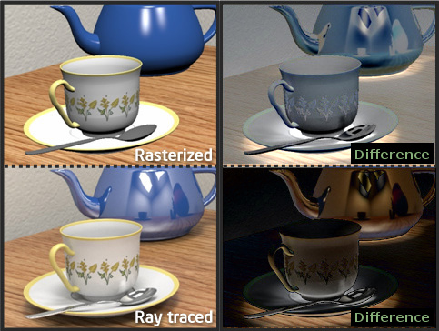
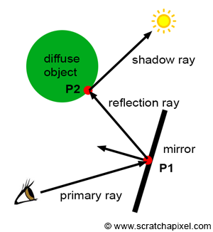
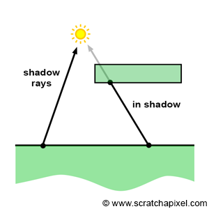
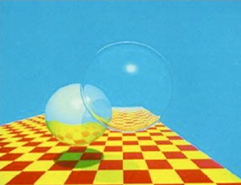
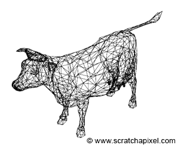
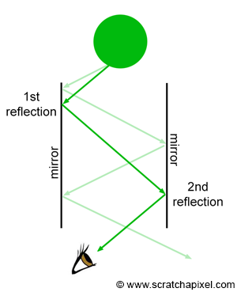
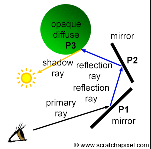
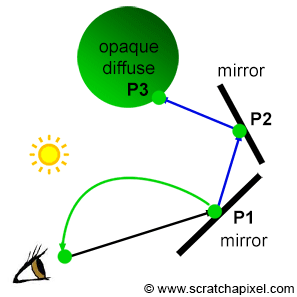

<section id="themes">
	<h2>Themes</h2>
		<p>
			Set your presentation theme: <br>
			<!-- Hacks to swap themes after the page has loaded. Not flexible and only intended for the reveal.js demo deck. -->
                        <a href="#" onclick="document.getElementById('theme').setAttribute('href','css/theme/black.css'); return false;">Black (default)</a> -
			<a href="#" onclick="document.getElementById('theme').setAttribute('href','css/theme/white.css'); return false;">White</a> -
			<a href="#" onclick="document.getElementById('theme').setAttribute('href','css/theme/league.css'); return false;">League</a> -
			<a href="#" onclick="document.getElementById('theme').setAttribute('href','css/theme/sky.css'); return false;">Sky</a> -
			<a href="#" onclick="document.getElementById('theme').setAttribute('href','css/theme/beige.css'); return false;">Beige</a> -
			<a href="#" onclick="document.getElementById('theme').setAttribute('href','css/theme/simple.css'); return false;">Simple</a> <br>
			<a href="#" onclick="document.getElementById('theme').setAttribute('href','css/theme/serif.css'); return false;">Serif</a> -
			<a href="#" onclick="document.getElementById('theme').setAttribute('href','css/theme/blood.css'); return false;">Blood</a> -
			<a href="#" onclick="document.getElementById('theme').setAttribute('href','css/theme/night.css'); return false;">Night</a> -
			<a href="#" onclick="document.getElementById('theme').setAttribute('href','css/theme/moon.css'); return false;">Moon</a> -
			<a href="#" onclick="document.getElementById('theme').setAttribute('href','css/theme/solarized.css'); return false;">Solarized</a>
		</p>
</section>

H:

# Rendering

Visual Computing

H:

# Outline

1. Introduction: the problem
2. Ray-tracing approach
3. Rasterization approach
4. Final thoughts

H:

## Introduction: Alberti's Veil
### Linear perspective

<figure>
    
    <figcaption>[Dürer's Alberti Veil](http://visualcomputing.github.io/Cognitive)</figcaption>
</figure>

V:

## Introduction: [Virtual camera model](https://www.scratchapixel.com/lessons/3d-basic-rendering/3d-viewing-pinhole-camera/virtual-pinhole-camera-model)
### Representation

<figure>
    
    <figcaption>Non inversion of the rendered image</figcaption>
</figure>

V:

## Introduction: [Virtual camera model](https://www.scratchapixel.com/lessons/3d-basic-rendering/3d-viewing-pinhole-camera/virtual-pinhole-camera-model)
### Frustum

<figure>
    
    <figcaption>Near and far clipping frustum planes</figcaption>
</figure>

V:

## Introduction: [Virtual camera model](https://www.scratchapixel.com/lessons/3d-basic-rendering/3d-viewing-pinhole-camera/virtual-pinhole-camera-model)
### Image plane

<figure>
    
    <figcaption>Various valid canvas positions</figcaption>
</figure>

V:

## Introduction: [Virtual camera model](https://www.scratchapixel.com/lessons/3d-basic-rendering/3d-viewing-pinhole-camera/virtual-pinhole-camera-model)
### Image plane

<figure>
    
    <figcaption>Positioning the canvas at the near plane</figcaption>
</figure>

V:

## Introduction: [Virtual camera model](https://www.scratchapixel.com/lessons/3d-basic-rendering/3d-viewing-pinhole-camera/virtual-pinhole-camera-model)
### Frustum

<figure>
    
    <figcaption>Frustum side view</figcaption>
</figure>

V:

## Introduction: Virtual camera model
### Challenges

> 1. Spatial coherence -> Visibility
<p>
> 2. Visual appealing -> Shading

V:

## Introduction: Virtual camera model
### Challenges: Visibility
#### Geometry related

<video width="400" height="400" controls data-autoplay loop src="vid/coordinate_system_no_depth.ogv"></video>

V:

## Introduction: Virtual camera model
### Challenges: Shading
#### Physics related

<figure>
    
    <figcaption>[Rendering equation](https://en.wikipedia.org/wiki/Rendering_equation)</figcaption>
</figure>

N:

integral equation in which the equilibrium radiance leaving a point is given as the sum of emitted plus reflected radiance under a geometric optics approximation

H:

## Raster approach: strategy
### Object centric

<figure>
    
    <figcaption>Perspective projection of points</figcaption>
</figure>

V:

## Raster approach: strategy
### Object centric

<figure>
    
    <figcaption>Perspective projection of a point</figcaption>
</figure>

V:

## Raster approach: strategy
### Object centric

```processing
for (each point in scene) {
transform point from world space to camera space;
perform perspective divide (x/-z, y/-z);
  if (point lies within canvas boundaries) {
    convert coordinates to NDC space;
    convert coordinates from NDC to raster space;
    record point in image;
  }
}
```

V:

## Raster approach: visibility
### [Hidden surface removal (HSR)](https://en.wikipedia.org/wiki/Hidden_surface_determination) algorithms

1. [Painter's algorithm](https://en.wikipedia.org/wiki/Painter%27s_algorithm)
1. [Binary space partioning (BSP)](https://en.wikipedia.org/wiki/Binary_space_partitioning)
1. [Warnock algorithm](https://en.wikipedia.org/wiki/Warnock_algorithm)
1. [Z-Buffering](https://en.wikipedia.org/wiki/Z-buffering)

V:

## Raster approach: visibility
### [Hidden surface removal (HSR)](https://en.wikipedia.org/wiki/Hidden_surface_determination) algorithms
#### [Painter's algorithm](https://en.wikipedia.org/wiki/Painter%27s_algorithm)

<figure>
    
    <figcaption>Draw distant objects first</figcaption>
</figure>

V:

## Raster approach: visibility
### [Hidden surface removal (HSR)](https://en.wikipedia.org/wiki/Hidden_surface_determination) algorithms
#### [Binary space partioning (BSP)](https://en.wikipedia.org/wiki/Binary_space_partitioning)

<figure>
    
    <figcaption>Input scene</figcaption>
</figure>

V:

## Raster approach: visibility
### [Hidden surface removal (HSR)](https://en.wikipedia.org/wiki/Hidden_surface_determination) algorithms
#### [Binary space partioning (BSP)](https://en.wikipedia.org/wiki/Binary_space_partitioning)

<figure>
    
    <figcaption>(Offline) subdivision step</figcaption>
</figure>

V:

## Raster approach: visibility
### [Hidden surface removal (HSR)](https://en.wikipedia.org/wiki/Hidden_surface_determination) algorithms
#### [Binary space partioning (BSP)](https://en.wikipedia.org/wiki/Binary_space_partitioning)

<figure>
    
    <figcaption>(Offline) subdivision step</figcaption>
</figure>

V:

## Raster approach: visibility
### [Hidden surface removal (HSR)](https://en.wikipedia.org/wiki/Hidden_surface_determination) algorithms
#### [Binary space partioning (BSP)](https://en.wikipedia.org/wiki/Binary_space_partitioning)

<figure>
    
    <figcaption>BSP Tree</figcaption>
</figure>

V:

## Raster approach: visibility
### [Hidden surface removal (HSR)](https://en.wikipedia.org/wiki/Hidden_surface_determination) algorithms
#### [Binary space partioning (BSP)](https://en.wikipedia.org/wiki/Binary_space_partitioning)

<figure>
    
    <figcaption>(Runtime) BSP visit</figcaption>
</figure>

V:

## Raster approach: visibility
### [Hidden surface removal (HSR)](https://en.wikipedia.org/wiki/Hidden_surface_determination) algorithms
#### [Warnock algorithm](https://en.wikipedia.org/wiki/Warnock_algorithm)

<figure>
    
    <figcaption>Polygon visibility cases: a) polygon fills the viewport, b) polygon partially and c) completely visible, d) polygon invisible</figcaption>
</figure>

V:

## Raster approach: visibility
### [Hidden surface removal (HSR)](https://en.wikipedia.org/wiki/Hidden_surface_determination) algorithms
#### [Warnock algorithm](https://en.wikipedia.org/wiki/Warnock_algorithm)

<figure>
    
    <figcaption>Subdivision step example</figcaption>
</figure>

V:

## Raster approach: visibility
### [Hidden surface removal (HSR)](https://en.wikipedia.org/wiki/Hidden_surface_determination) algorithms
#### [Z-Buffering](https://en.wikipedia.org/wiki/Z-buffering)

<figure>
    
    <figcaption>Zbuffer data</figcaption>
</figure>

V:

## Raster approach: shading

V:

## Raster approach: shading
#### SO... WHY DO GPUs USE RASTRERIZATION OVER RAY TRACING?

<figure>
    
</figure>

V:

## Raster approach: shading
### CREATE AN IMAGE IN RAY-TRACING

*   Cast a ray for each pixel in the image.
*   The first rays emitted are called primary rays or camera rays.
*   More rays can be spawned from primary rays. These other rays are called secondary rays.
*   When a primary ray is cast into the scene, the next step is to find if it intersects any object in the scene.
*   When primary rays are used to solve the visibility problem, we can use the term ray-casting.

V:

## Raster approach: shading
### HOW DOES SHADING WORK ON RAY-TRACING?

There are 2 main types of rays, Primary rays and secondary rays, Secondary rays can be Shadow Rays or reflection rays depending on their function.

V:

## Raster approach: shading
### HOW DOES SHADING WORK ON RAY-TRACING?

<figure>
    
		
</figure>

H:

## Ray-tracing approach: strategy
### Image centric

<figure>
    
    <figcaption>Casting rays into a scene</figcaption>
</figure>

V:

## Ray-tracing approach: strategy
### Image centric

<figure>
    
    <figcaption>Photorealism</figcaption>
</figure>

V:

## Ray-tracing approach: strategy
### Image centric

```processing
for (each pixel in the image) {
  // step 1
  build a camera ray: trace line from current pixel location to camera's aperture;
  // step 2
  cast ray into the scene;
  // step 3
  if (ray intersects an object) {
    set current pixel's color with object's color at the intersection point;
  } else {
    set current pixel's color to black;
  }
}
```

V:

## Ray-tracing approach: visibility

<figure>
    
    <figcaption>Visibility computation</figcaption>
</figure>

V:

## Ray-tracing approach: visibility

```processing
for (each pixel in the image) {
  // step 1
  build a camera ray: trace line from current pixel location to camera's aperture;
  // step 2
  cast ray into the scene;
  // step 3
  for (each object in the scene) {
    set current pixel's color with closest object's color at the intersection point;
  }
}
```

V:

## Ray-tracing approach: shading

V:

### Ray-tracing approach: shading
#### TESTING FOR RAY-GEOMETRIC INTERSECTIONS

Testing if a ray intersects any object in the scene requires to loop over all the objects in the scene and test the current object against the ray.

```
Ray ray = buildCameraRay(i, j);
for (int k = 0; k < numObjects; ++k) {
	if (intersect(ray, objects[k]) {
		// this ray intersects objects[k]
		}
	}
```

V:

### Ray-tracing approach: shading
#### TESTING FOR RAY-GEOMETRIC INTERSECTIONS
##### GEOMETRY IN 3D

*   **Simple shapes:** Can be defined mathematically, or parametrically.
*   **Shapes of more complex objects:** Can only be described using polygon meshes, subdivisions surfaces or NURBS surfaces (or something equivalent).

V:

### Ray-tracing approach: shading
#### TESTING FOR RAY-GEOMETRIC INTERSECTIONS
##### GEOMETRY IN 3D

<figure>
    
    <figcaption>Ray can intersect several objects</figcaption>
</figure>

V:

### Ray-tracing approach: shading
#### TESTING FOR RAY-GEOMETRIC INTERSECTIONS
##### COMPLEX SHAPES

Convert each geometry type into the same internal representation, which in almost 99% of the cases, is going to be a triangulated polygon mesh.

<figure>
    
    <figcaption>Visibility computation</figcaption>
</figure>

V:


## WHITTED RAY-TRACING

### WHITTED RAY-TRACING

It’s one of the most classical examples of light transport algorithm based on ray-tracing.

<figure>
    
    <figcaption>Image produced by Turner Whitted with the algorithm he developed in 1980</figcaption>
</figure>

V:

### WHITTED RAY-TRACING

If an object A is a mirror like surface, and that an object B seats on top of it, then we would like to see the reflection of B into A.

If A is not a flat surface, there is no easy solution for computing this reflection.

Things get even harder if B is also reflective. Mirror surfaces keep reflecting images of themselves causing the "infinity room" effect.

V:

### WHITTED RAY-TRACING

<figure>
    
    <figcaption>A light ray emitted by the sphere bounces multiple times off of the surface of the two mirrors before it reaches the eye</figcaption>
</figure>

V:

### WHITTED RAY-TRACING

The refraction direction can be computed using Snell's law and depends on the surface orientation (the surface's normal), the incoming light direction and the material refractive index (around 1.3 for water and 1.5 for glass).

V:

## WHITTED RAY-TRACING

Whitted proposed to use these laws to compute the reflection and refraction direction of rays as they intersect reflective or transparent surfaces, and follow the path of these rays to find out the color of the object they would intersect.

V:

### WHITTED RAY-TRACING
#### SNELL'S LAW

Three cases:

1.  If the surface at the intersection point is opaque and diffuse, use the [Phong model](https://en.wikipedia.org/wiki/Phong_reflection_model), to compute the color of the object at the intersection point.
2.  If the surface is a mirror like surface, trace another reflection ray at the intersection point.
3.  if the surface is a transparent surface, cast another reflection and a refraction ray at the intersection point.

V:

### WHITTED RAY-TRACING

<figure>
    
		
    <figcaption>How do we find the color reflected off of the surface of a mirror?</figcaption>
</figure>

H:

## Final thoughts

> Problem: Implement Alberti's Veil on a computer -> virtual (pinhole) camera model

<!-- .element: class="fragment" data-fragment-index="1"-->

> Challenges: visibility (geometry) & shading (physics)

<!-- .element: class="fragment" data-fragment-index="2"-->

> Strategies: Raster vs Ray-tracing

<!-- .element: class="fragment" data-fragment-index="3"-->

V:

## Final thoughts
### Raster vs Ray-tracing

| _Feature_         | Rasterization | Ray-tracing |
|-------------------|---------------|-------------|
| _Philosophy_      | [Intromission](https://en.wikipedia.org/wiki/Visual_perception#Early_studies)  | [Emission](https://en.wikipedia.org/wiki/Visual_perception#Early_studies) |
| _Visibility_      | Easy          | Trivial     |
| _Shading_ realism | _Promising_   | Great       |
| _Parallelizable_  | Easy          | Hard        |
| _Complexity_      | Linear        | Exponential |

V:

## Final thoughts
### [OpenGL pipeline](https://www.khronos.org/opengl/wiki/Rendering_Pipeline_Overview)

<figure>
    
    <figcaption>Opengl Rendering Pipeline</figcaption>
</figure>

N:

1. Virtual camera: vertex specification & vertex shader
2. Shading: fragment shader
3. Visibility (z-buffer): per sample operations

V:

## Final thoughts
### [OpenGL pipeline](https://www.khronos.org/opengl/wiki/Rendering_Pipeline_Overview): [Virtual camera model](https://learnopengl.com/#!Getting-started/Coordinate-Systems)

<figure>
    
    <figcaption>Matrix transform operations</figcaption>
</figure>

H:

## References

1. [Learn Computer Graphics From Scratch!](http://www.scratchapixel.com/)
1. [2D cross-product](https://www.gamedev.net/forums/topic/289972-cross-product-of-2d-vectors/)
1. [OpenGL coordinate systems](https://learnopengl.com/#!Getting-started/Coordinate-Systems)
1. [OpenGL pipeline](https://www.khronos.org/opengl/wiki/Rendering_Pipeline_Overview)