<section id="themes">
	<h2>Themes</h2>
		<p>
			Set your presentation theme: <br>
			<!-- Hacks to swap themes after the page has loaded. Not flexible and only intended for the reveal.js demo deck. -->
                        <a href="#" onclick="document.getElementById('theme').setAttribute('href','css/theme/black.css'); return false;">Black (default)</a> -
			<a href="#" onclick="document.getElementById('theme').setAttribute('href','css/theme/white.css'); return false;">White</a> -
			<a href="#" onclick="document.getElementById('theme').setAttribute('href','css/theme/league.css'); return false;">League</a> -
			<a href="#" onclick="document.getElementById('theme').setAttribute('href','css/theme/sky.css'); return false;">Sky</a> -
			<a href="#" onclick="document.getElementById('theme').setAttribute('href','css/theme/beige.css'); return false;">Beige</a> -
			<a href="#" onclick="document.getElementById('theme').setAttribute('href','css/theme/simple.css'); return false;">Simple</a> <br>
			<a href="#" onclick="document.getElementById('theme').setAttribute('href','css/theme/serif.css'); return false;">Serif</a> -
			<a href="#" onclick="document.getElementById('theme').setAttribute('href','css/theme/blood.css'); return false;">Blood</a> -
			<a href="#" onclick="document.getElementById('theme').setAttribute('href','css/theme/night.css'); return false;">Night</a> -
			<a href="#" onclick="document.getElementById('theme').setAttribute('href','css/theme/moon.css'); return false;">Moon</a> -
			<a href="#" onclick="document.getElementById('theme').setAttribute('href','css/theme/solarized.css'); return false;">Solarized</a>
		</p>
</section>

H:

# Rendering

Jean Pierre Charalambos  
Universidad Nacional de Colombia

H:

# Outline

1. Introduction: the problem
2. Rasterization approach
3. Ray-tracing approach
4. Final thoughts

H:

## Introduction: Alberti's Veil
### Linear perspective

<figure>
    
    <figcaption>[Dürer's Alberti Veil](http://visualcomputing.github.io/Cognitive)</figcaption>
</figure>

V:

## Introduction: [Virtual camera model](https://www.scratchapixel.com/lessons/3d-basic-rendering/3d-viewing-pinhole-camera/virtual-pinhole-camera-model)
### Representation

<figure>
    
    <figcaption>Non inversion of the rendered image</figcaption>
</figure>

V:

## Introduction: [Virtual camera model](https://www.scratchapixel.com/lessons/3d-basic-rendering/3d-viewing-pinhole-camera/virtual-pinhole-camera-model)
### Frustum

<figure>
    
    <figcaption>Near and far clipping frustum planes</figcaption>
</figure>

V:

## Introduction: [Virtual camera model](https://www.scratchapixel.com/lessons/3d-basic-rendering/3d-viewing-pinhole-camera/virtual-pinhole-camera-model)
### Image plane

<figure>
    
    <figcaption>Various valid canvas positions</figcaption>
</figure>

V:

## Introduction: [Virtual camera model](https://www.scratchapixel.com/lessons/3d-basic-rendering/3d-viewing-pinhole-camera/virtual-pinhole-camera-model)
### Image plane

<figure>
    
    <figcaption>Positioning the canvas at the near plane</figcaption>
</figure>

V:

## Introduction: [Virtual camera model](https://www.scratchapixel.com/lessons/3d-basic-rendering/3d-viewing-pinhole-camera/virtual-pinhole-camera-model)
### Frustum

<figure>
    
    <figcaption>Frustum side view</figcaption>
</figure>

V:

## Introduction: Virtual camera model
### Challenges

> 1. Spatial coherence -> Visibility
<p>
> 2. Visual appealing -> Shading

V:

## Introduction: Virtual camera model
### Challenges: Visibility
#### Geometry related

<video width="400" height="400" controls data-autoplay loop src="vid/coordinate_system_no_depth.ogv"></video>

V:

## Introduction: Virtual camera model
### Challenges: Shading
#### Physics related

<figure>
    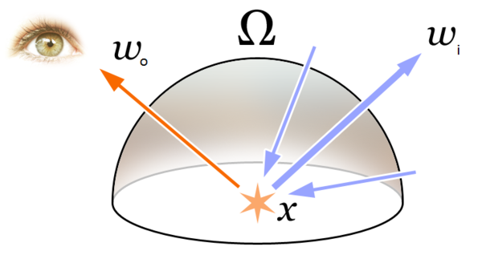
    <figcaption>[Rendering equation](https://en.wikipedia.org/wiki/Rendering_equation)</figcaption>
</figure>

N:

integral equation in which the equilibrium radiance leaving a point is given as the sum of emitted plus reflected radiance under a geometric optics approximation

H:

## Raster approach: strategy
### Object centric

<figure>
    
    <figcaption>Perspective projection of points</figcaption>
</figure>

V:

## Raster approach: strategy
### Object centric

<figure>
    
    <figcaption>Perspective projection of a point</figcaption>
</figure>

V:

## Raster approach: strategy
### Object centric

```processing
for (each point in scene) {
transform point from world space to camera space;
perform perspective divide (x/-z, y/-z);
  if (point lies within canvas boundaries) {
    convert coordinates to NDC space;
    convert coordinates from NDC to raster space;
    record point in image;
  }
}
```

V:

## Raster approach: visibility
### [Hidden surface removal (HSR)](https://en.wikipedia.org/wiki/Hidden_surface_determination) algorithms

1. [Painter's algorithm](https://en.wikipedia.org/wiki/Painter%27s_algorithm)
1. [Binary space partioning (BSP)](https://en.wikipedia.org/wiki/Binary_space_partitioning)
1. [Warnock algorithm](https://en.wikipedia.org/wiki/Warnock_algorithm)
1. [Z-Buffering](https://en.wikipedia.org/wiki/Z-buffering)

V:

## Raster approach: visibility
### [Hidden surface removal (HSR)](https://en.wikipedia.org/wiki/Hidden_surface_determination) algorithms
#### [Painter's algorithm](https://en.wikipedia.org/wiki/Painter%27s_algorithm)

<figure>
    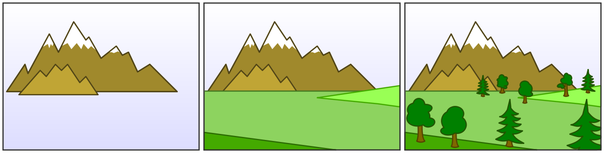
    <figcaption>Draw distant objects first</figcaption>
</figure>

V:

## Raster approach: visibility
### [Hidden surface removal (HSR)](https://en.wikipedia.org/wiki/Hidden_surface_determination) algorithms
#### [Binary space partioning (BSP)](https://en.wikipedia.org/wiki/Binary_space_partitioning)

<figure>
    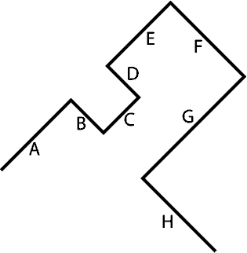
    <figcaption>Input scene</figcaption>
</figure>

V:

## Raster approach: visibility
### [Hidden surface removal (HSR)](https://en.wikipedia.org/wiki/Hidden_surface_determination) algorithms
#### [Binary space partioning (BSP)](https://en.wikipedia.org/wiki/Binary_space_partitioning)

<figure>
    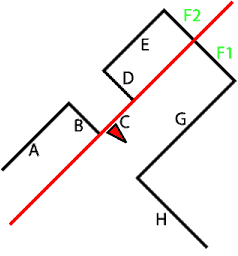
    <figcaption>(Offline) subdivision step</figcaption>
</figure>

V:

## Raster approach: visibility
### [Hidden surface removal (HSR)](https://en.wikipedia.org/wiki/Hidden_surface_determination) algorithms
#### [Binary space partioning (BSP)](https://en.wikipedia.org/wiki/Binary_space_partitioning)

<figure>
    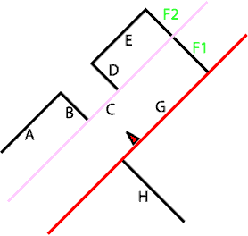
    <figcaption>(Offline) subdivision step</figcaption>
</figure>

V:

## Raster approach: visibility
### [Hidden surface removal (HSR)](https://en.wikipedia.org/wiki/Hidden_surface_determination) algorithms
#### [Binary space partioning (BSP)](https://en.wikipedia.org/wiki/Binary_space_partitioning)

<figure>
    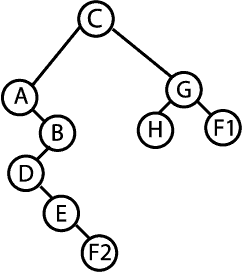
    <figcaption>BSP Tree</figcaption>
</figure>

V:

## Raster approach: visibility
### [Hidden surface removal (HSR)](https://en.wikipedia.org/wiki/Hidden_surface_determination) algorithms
#### [Binary space partioning (BSP)](https://en.wikipedia.org/wiki/Binary_space_partitioning)

<figure>
    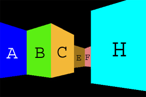
    <figcaption>(Runtime) BSP visit</figcaption>
</figure>

V:

## Raster approach: visibility
### [Hidden surface removal (HSR)](https://en.wikipedia.org/wiki/Hidden_surface_determination) algorithms
#### [Warnock algorithm](https://en.wikipedia.org/wiki/Warnock_algorithm)

<figure>
    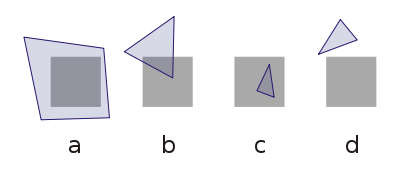
    <figcaption>Polygon visibility cases: a) polygon fills the viewport, b) polygon partially and c) completely visible, d) polygon invisible</figcaption>
</figure>

V:

## Raster approach: visibility
### [Hidden surface removal (HSR)](https://en.wikipedia.org/wiki/Hidden_surface_determination) algorithms
#### [Warnock algorithm](https://en.wikipedia.org/wiki/Warnock_algorithm)

<figure>
    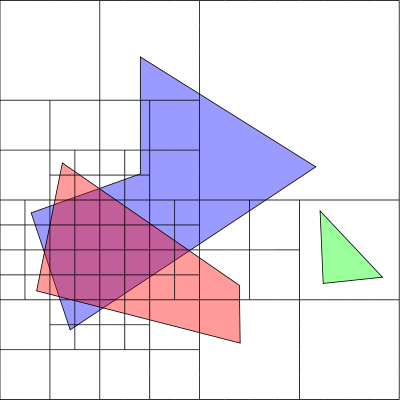
    <figcaption>Subdivision step example</figcaption>
</figure>

V:

## Raster approach: visibility
### [Hidden surface removal (HSR)](https://en.wikipedia.org/wiki/Hidden_surface_determination) algorithms
#### [Z-Buffering](https://en.wikipedia.org/wiki/Z-buffering)

<figure>
    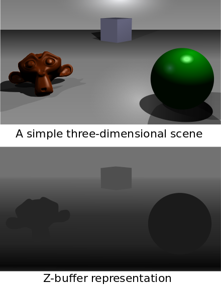
    <figcaption>Zbuffer data</figcaption>
</figure>

V:

## Raster approach: shading
### Barycentric coordinates overview

`$F_{01}(p) := (v_{0y} - v_{1y}) p_x + (v_{1x} - v_{0x}) p_y + (v_{0x} v_{1y} - v_{0y} v_{1x})$`
`$F_{12}(p) := (v_{1y} - v_{2y}) p_x + (v_{2x} - v_{1x}) p_y + (v_{1x} v_{2y} - v_{1y} v_{2x})$`
`$F_{20}(p) := (v_{2y} - v_{0y}) p_x + (v_{0x} - v_{2x}) p_y + (v_{2x} v_{0y} - v_{2y} v_{0x})$`

<figure>
    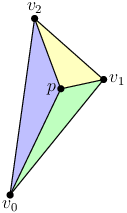
    <figcaption>[Edge functions](https://fgiesen.wordpress.com/2013/02/06/the-barycentric-conspirac/)</figcaption>
</figure>

V:

## Raster approach: shading
### Barycentric coordinates: properties

`$F_{01}(v_0) = F_{01}(v_1) = 0$`

`$F_{01}(v_2) = 2 \triangle(v_0,v_1,v_2)$`

<figure>
    
    <figcaption>[Edge functions](https://fgiesen.wordpress.com/2013/02/06/the-barycentric-conspirac/)</figcaption>
</figure>

V:

## Raster approach: shading
### Barycentric coordinates of a point $p$

`$w_0(p) := F_{12}(p)$`

`$w_1(p) := F_{20}(p)$`

`$w_2(p) := F_{01}(p)$`

which are simply the edge functions evaluated at $p$

> if `$w_0(p) > 0$`, `$w_1(p) > 0$` and `$w_2(p) > 0$` (for WCC) then `$p \in \triangle(v_0,v_1,v_2)$`

V:

## Raster approach: shading
### Normalized barycentric coordinates of a point $p$

`$\lambda_0(p) := F_{12}(p) / 2 \triangle(v_0,v_1,v_2)$`

`$\lambda_1(p) := F_{20}(p) / 2 \triangle(v_0,v_1,v_2)$`

`$\lambda_2(p) := F_{01}(p) / 2 \triangle(v_0,v_1,v_2)$`

where `$\lambda_0(p) + \lambda_1(p) + \lambda_2(p) = 1$`

V:

## Raster approach: shading
### Uses: 1. Rasterization (using signed edge functions)

<figure>
    
    <figcaption>[Rasterization](https://www.scratchapixel.com/lessons/3d-basic-rendering/rasterization-practical-implementation/rasterization-stage)</figcaption>
</figure>

V:

## Raster approach: shading
### Uses: 2. Antialiasing (using signed edge functions)

<figure>
    
    <figcaption>[Anti-aliasing](https://www.scratchapixel.com/lessons/3d-basic-rendering/rasterization-practical-implementation/rasterization-practical-implementation)</figcaption>
</figure>

V:

## Raster approach: shading
### Uses: 2. Antialiasing (using signed edge functions)

<figure>
    
    <figcaption>[Anti-aliasing](https://www.scratchapixel.com/lessons/3d-basic-rendering/rasterization-practical-implementation/rasterization-practical-implementation)</figcaption>
</figure>

V:

## Raster approach: shading
### Uses: 3. Interpolation (using normalized barycentric coordinate)

<figure>
    
    <figcaption>[Color interpolation](https://www.scratchapixel.com/lessons/3d-basic-rendering/rasterization-practical-implementation/rasterization-stage)</figcaption>
</figure>

> Anything can be interpolated!

V:

## Raster approach: shading
### References

* [The barycentric conspiracy](https://fgiesen.wordpress.com/2013/02/06/the-barycentric-conspirac/)
* [Rasterization Stage](https://www.scratchapixel.com/lessons/3d-basic-rendering/rasterization-practical-implementation/rasterization-stage)
* [Anti-aliasing](https://www.scratchapixel.com/lessons/3d-basic-rendering/rasterization-practical-implementation/rasterization-practical-implementation)

H:

## Ray-tracing approach: strategy
### Image centric

<figure>
    
    <figcaption>Casting rays into a scene</figcaption>
</figure>

V:

## Ray-tracing approach: strategy
### Image centric

<figure>
    
    <figcaption>Photorealism</figcaption>
</figure>

V:

## Ray-tracing approach: strategy
### Image centric

```processing
for (each pixel in the image) {
  // step 1
  build a camera ray: trace line from current pixel location to camera's aperture;
  // step 2
  cast ray into the scene;
  // step 3
  if (ray intersects an object) {
    set current pixel's color with object's color at the intersection point;
  } else {
    set current pixel's color to black;
  }
}
```

V:

## Ray-tracing approach: visibility

<figure>
    
    <figcaption>Visibility computation</figcaption>
</figure>

V:

## Ray-tracing approach: visibility

```processing
for (each pixel in the image) {
  // step 1
  build a camera ray: trace line from current pixel location to camera's aperture;
  // step 2
  cast ray into the scene;
  // step 3
  for (each object in the scene) {
    set current pixel's color with closest object's color at the intersection point;
  }
}
```

V:

## Ray-tracing approach: shading

1. [Overview of the Ray-Tracing Rendering Technique](https://www.scratchapixel.com/lessons/3d-basic-rendering/ray-tracing-overview).
2. [Light Transport Algorithms and Ray-Tracing: Whitted Ray-Tracing](https://www.scratchapixel.com/lessons/3d-basic-rendering/ray-tracing-overview/light-transport-ray-tracing-whitted).

H:

## Final thoughts

> Problem: Implement Alberti's Veil on a computer -> virtual (pinhole) camera model

<!-- .element: class="fragment" data-fragment-index="1"-->

> Challenges: visibility (geometry) & shading (physics)

<!-- .element: class="fragment" data-fragment-index="2"-->

> Strategies: Raster vs Ray-tracing

<!-- .element: class="fragment" data-fragment-index="3"-->

V:

## Final thoughts
### Raster vs Ray-tracing

| _Feature_         | Rasterization | Ray-tracing |
|-------------------|---------------|-------------|
| _Philosophy_      | [Intromission](https://en.wikipedia.org/wiki/Visual_perception#Early_studies)  | [Emission](https://en.wikipedia.org/wiki/Visual_perception#Early_studies) |
| _Visibility_      | Easy          | Trivial     |
| _Shading_ realism | _Promising_   | Great       |
| _Parallelizable_  | Easy          | Hard        |
| _Complexity_      | Linear        | Exponential |

V:

## Final thoughts
### [OpenGL pipeline](https://www.khronos.org/opengl/wiki/Rendering_Pipeline_Overview)

<figure>
    
    <figcaption>Opengl Rendering Pipeline</figcaption>
</figure>

N:

1. Virtual camera: vertex specification & vertex shader
2. Shading: fragment shader
3. Visibility (z-buffer): per sample operations

V:

## Final thoughts
### [OpenGL pipeline](https://www.khronos.org/opengl/wiki/Rendering_Pipeline_Overview): [Virtual camera model](https://learnopengl.com/#!Getting-started/Coordinate-Systems)

<figure>
    
    <figcaption>Matrix transform operations</figcaption>
</figure>

H:

## References

1. [Learn Computer Graphics From Scratch!](http://www.scratchapixel.com/)
1. [2D cross-product](https://www.gamedev.net/forums/topic/289972-cross-product-of-2d-vectors/)
1. [OpenGL coordinate systems](https://learnopengl.com/#!Getting-started/Coordinate-Systems)
1. [OpenGL pipeline](https://www.khronos.org/opengl/wiki/Rendering_Pipeline_Overview)
